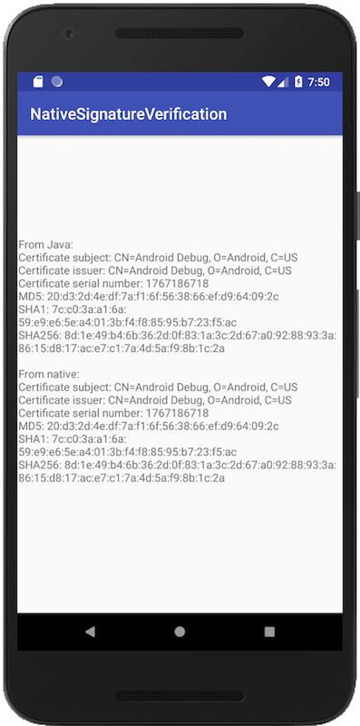
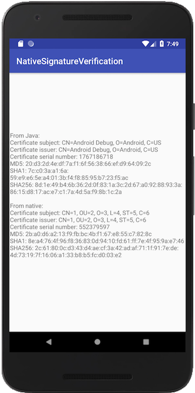

# How to prevent tampering signatures of APK-files using C (Native check of a signature of APKs)

It may be helpful only for  non-rooted devices (and of course reverse-engineer always wins).

The example of obtaining apk's signature on the native layer (without jni).

This example was created to help developers stand against one type of an attack. 
The attack inserts code into Application class (or creates it), 
hooks the getPackageInfo method of the PackageManager then returns an original signature on demand. 
This attack is implemented in `'nkstool'` tool.
After user has applied `'nkstool'` tool on your APK, the application always gets its own signature 
in Java layer or through JNI when it's requested in APK even though it is not true.

The source code of this attacking tool can be found here:
https://github.com/L-JINBIN/ApkSignatureKiller

Working example of this tool is in the [`'/nkstool'`](./nkstool) directory 
only for testing and educational purposes!

To test this example (nkstool) just dot he following:
* edit [config.txt](./nkstool/config.txt)

* copy your APK (the one to be hacked) to the same directory [`'/nkstool'`](./nkstool)

* run script either `'run.bat'` or `'run.sh'`

Finally you can see results of the checks:

## Before the attack  - all signatures are equal

## After the attack - signatures are not equal. Native layer (C-code) gives you the real signature of the APK.

# How do we get a real signature:

* Get a path of our APK

* Extract `'META-INF/CERT.RSA'` from the APK

* Parse `'META-INF/CERT.RSA'`

* We pass a signature through JNI from native layer to Java (just for convenience)

# [Here](https://stackoverflow.com/a/50976883/3166697) is an example how we can get MD5 from a signature(using [mbed TLS](https://tls.mbed.org/))

Also I suggest you do not forget about '-fvisibility=hidden' flag.

#### Used libraries and projects:

 * [Minizip](https://github.com/nmoinvaz/minizip) This program is distributed under the terms of the same license as zlib.
 * [https://github.com/W-WTerDan/pkcs7](https://github.com/W-WTerDan/pkcs7) Public domain

### Thanks
    
 *  Guys who constantly crack my applications (and not only mine) and post their tools. I was inspired by [this one](http://4pda.ru/forum/index.php?s=&showtopic=461675&view=findpost&p=68086735).
 *  floyd and others from [StackOverflow post](https://stackoverflow.com/q/30650006/3166697)

#### Licence

MIT License

Copyright (c) 2018 Dmitrii Kozhevin <kozhevin.dima@gmail.com>

Permission is hereby granted, free of charge, to any person obtaining a copy
of this software and associated documentation files (the "Software"), to deal
in the Software without restriction, including without limitation the rights
to use, copy, modify, merge, publish, distribute, sublicense, and/or sell
copies of the Software, and to permit persons to whom the Software is
furnished to do so, subject to the following conditions:

The above copyright notice and this permission notice shall be included in all
copies or substantial portions of the Software.

THE SOFTWARE IS PROVIDED "AS IS", WITHOUT WARRANTY OF ANY KIND, EXPRESS OR
IMPLIED, INCLUDING BUT NOT LIMITED TO THE WARRANTIES OF MERCHANTABILITY,
FITNESS FOR A PARTICULAR PURPOSE AND NONINFRINGEMENT. IN NO EVENT SHALL THE
AUTHORS OR COPYRIGHT HOLDERS BE LIABLE FOR ANY CLAIM, DAMAGES OR OTHER
LIABILITY, WHETHER IN AN ACTION OF CONTRACT, TORT OR OTHERWISE, ARISING FROM,
OUT OF OR IN CONNECTION WITH THE SOFTWARE OR THE USE OR OTHER DEALINGS IN THE
SOFTWARE.
